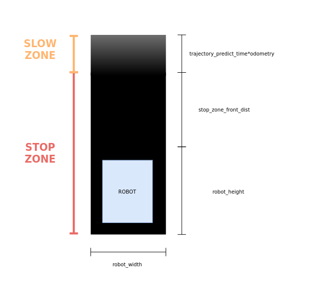

## Parameters
* unit: meter, radian, second
### Topics and frame names
* odom_topic:
    * odometry input (nav_msgs::Odometry)
* laser_topic1:
    * laser scan input1 (sensor_msgs::LaserScan)
* laser_topic2:
    * laser scan input2 (sensor_msgs::LaserScan)
* base_frame:
    * robot frame id
* output_grid_topic:
    * visualize safe zone (nav_msgs::OccupancyGrid)
* output_velocity_topic:
    * velocity command output (geometry_msgs::Twist)
* velocity_publish_duration:
    * publish period for output_velocity_topic
* grid_publish_duration:
    * publish period for output_grid_topic

### Robot Parameters
* mat_resolution:
    * draw and compute resolution
* min_rotate_angle:
    * if robot rotate more than this threshold, draw curve rather than line
* robot_width:
    * robot width + stop zone width
* robot_height:
    * robot height + stop zone height
* stop_zone_front_dist:
    * addtion stop zone size in front of robot
* trajectory_predict_time:
    * slow zone growing gain
* max_speed
    * robot max speed

